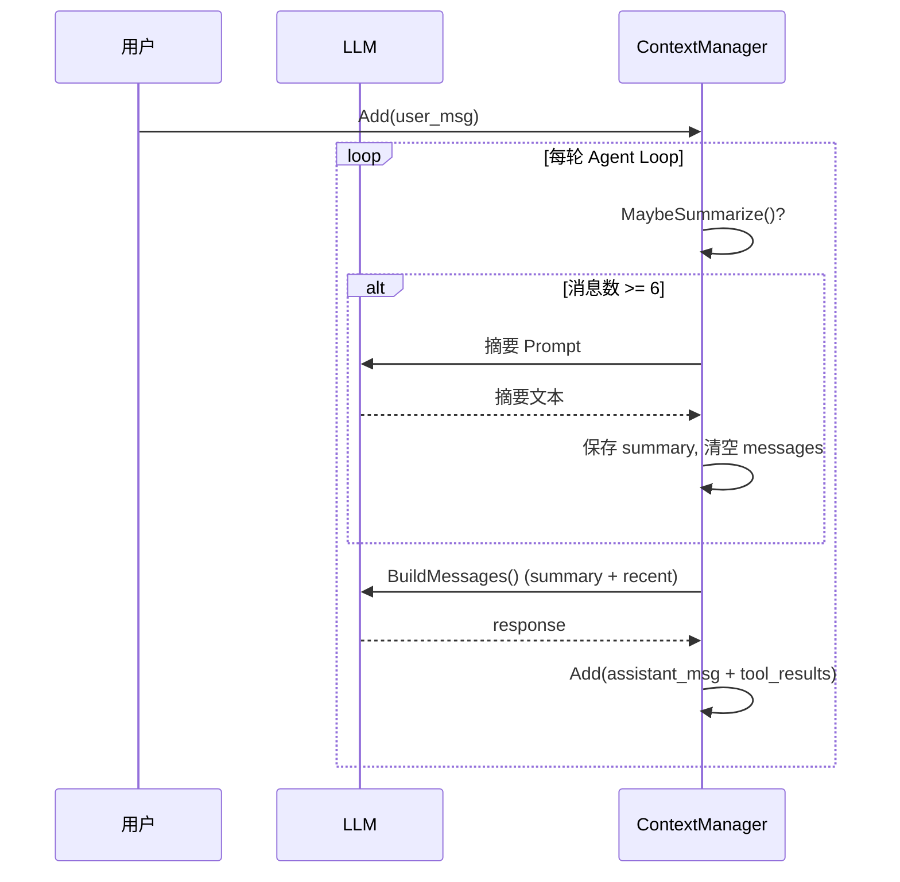

# Step 6 · Context Management 详解

> 📚 对应学习计划：[README §Step 6](../README.md)
> 🗓️ 时间：今天
> 💻 关键代码：`memory/context.go`（175 行）

---

## 🎯 核心问题

> 为什么 Agent 需要 Context Management？

Agent 跑久了：
1. **消息历史会膨胀**（每次循环多 2 条：Assistant Tool Call + Tool Result）
2. **LLM 有上下文窗口限制**（gpt-4o: 128k, claude-sonnet-4-5: 200k, MiniMax-M3: 视具体）
3. **Token 成本会放大**（每轮都重新发送整个历史）

**Context Management** = 控制「LLM 每次请求实际看到什么」

---

## 🧠 Context vs Memory（关键区分）

| 维度 | Context | Memory |
|------|---------|--------|
| **范围** | 当前对话 | 跨对话 |
| **谁能看到** | LLM（每次请求） | 程序（决定要不要给 LLM）|
| **生命周期** | 一次 Agent Run | 长期 |
| **存储位置** | `ContextManager.messages` | `Memory.data` |
| **典型问题** | "这次请求 LLM 看哪些历史？" | "下次对话 Agent 还能记住什么？" |

> **面试高频题**：Context 和 Memory 经常被混在一起。**记住一个核心区分**：
> - Context 是「当前对话上下文」→ 给 LLM 看
> - Memory 是「跨任务信息」→ 程序管理，按需给 LLM

---

## 🏗️ ContextManager 实现

### 数据结构

```go
type ContextManager struct {
    messages []openai.ChatCompletionMessageParamUnion  // 当前消息历史
    summary  string                                    // 旧消息摘要
}
```

### 核心方法

```go
// 1. 添加一条消息
func (cm *ContextManager) Add(msg openai.ChatCompletionMessageParamUnion)

// 2. 当消息达到阈值时，自动摘要
func (cm *ContextManager) MaybeSummarize(ctx, client, model) error

// 3. 构造最终发送给 LLM 的消息
func (cm *ContextManager) BuildMessages() []Message
```

### 调用时机（Agent Loop）

```go
// agent/agent.go 中的 Agent Loop
for {
    // ★ 摘要检查放在调用 LLM 之前 ★
    if err := a.memory.MaybeSummarize(ctx, client, model); err != nil {
        return "", err
    }

    messages := a.memory.BuildMessages()
    resp, _ := a.client.Chat.Completions.New(ctx, ...)

    // ... 处理 Tool Call ...
}
```

---

## 📐 摘要触发策略

### 当前实现（最简版）

```go
func (cm *ContextManager) MaybeSummarize(ctx, client, model) error {
    if len(cm.messages) < 6 {
        return nil  // 不到阈值不摘要
    }
    return cm.Summarize(ctx, client, model)
}
```

**阈值 = 6 条消息**（实测配置）。

### 生产环境更合理的策略

| 策略 | 优点 | 缺点 |
|------|------|------|
| 按消息数 | 简单 | 不考虑消息长度 |
| **按 Token 数** ✅ | 精确控制成本 | 需要 tokenizer 库 |
| 按时间窗口 | 适合实时场景 | 消息可能长短不一 |

**推荐**：用 Token 数（OpenAI 提供 `tiktoken` 库可精确计算）。

---

## 📦 摘要内容构建（BuildMessages）

```
┌──────────────────────────────────────┐
│ System Prompt (如果有)                │  ← 不在 ContextManager 里
├──────────────────────────────────────┤
│ Summary Message (如果有)               │  ← 旧消息的压缩
│   "以下是之前对话的摘要..."            │
├──────────────────────────────────────┤
│ Recent Messages                       │  ← 最近的 N 条
│   User                                │
│   Assistant (Tool Call)               │
│   Tool                                │
│   ...                                 │
└──────────────────────────────────────┘
```

**实现**：

```go
func (cm *ContextManager) BuildMessages() []Message {
    messages := make([]Message, 0)

    if cm.summary != "" {
        summaryMessage := fmt.Sprintf(
            "以下是之前对话的摘要，请结合摘要理解当前对话：\n%s",
            cm.summary,
        )
        messages = append(messages, openai.UserMessage(summaryMessage))
    }

    messages = append(messages, cm.messages...)
    return messages
}
```

---

## 🔍 摘要的具体过程

### 触发条件

`len(cm.messages) >= 6`

### 执行步骤

1. **序列化当前 messages**（`json.Marshal`）
2. **构造摘要 Prompt**：

```
请总结下面这段 Agent 对话历史。

要求：
1. 保留用户的重要需求
2. 保留已经查询到的重要业务数据
3. 保留订单、用户、支付、物流等关键状态
4. 忽略无关的中间过程
5. 输出简洁的中文摘要

对话历史：
{...}
```

3. **调用 LLM 摘要**
4. **保存摘要到 `cm.summary`**
5. **清空 `cm.messages`**

### 效果示例

**摘要前**（假设有 8 条消息）：
```
[user] 请分析订单10001
[assistant] tool_call: query_order(10001)
[tool] 订单10001已发货...
[assistant] tool_call: query_payment(10001)
[tool] 订单已支付...
[assistant] tool_call: query_logistics(10001)
[tool] 物流单号123456...
[user] 那物流什么时候到？
```

**摘要后**：
- `cm.summary` = "用户1001询问订单10001的状态，已确认订单已发货已支付，物流单号123456"
- `cm.messages` = `[那物流什么时候到？]`（只剩 1 条最新消息）

**下次 LLM 看到的**：
- 1 条摘要消息（system 注入）
- 1 条最新 user 消息

---

## ⚠️ 当前实现的已知问题

### 问题 1：OpenAI SDK 消息序列化丢失 Tool Call 结构

```go
// memory/context.go Summarize
data, err := json.Marshal(cm.messages)  // ← 这里丢信息
```

`json.Marshal` 会把 `ChatCompletionMessageParamUnion` 序列化为通用 JSON，但 **Assistant Tool Call 的结构（ID、Function Name、Arguments）变得不完整**。

**影响**：摘要 LLM 看不懂 Tool Call 上下文，摘要质量下降。

**生产解决**：用 OpenAI SDK 提供的 `message.ToParam()` 反向序列化，或维护 messages 的人可读副本。

### 问题 2：Tool Call 链完整性

摘要后清空 messages，可能破坏这样的配对关系：

```
Assistant: tool_call A
Tool:       result A  ← 必须配对
```

**生产解决**：摘要时**保留 Assistant + Tool Result 配对**，只摘要其他消息。

### 问题 3：摘要累积

当前实现：**摘要后清空 messages**。

**第二次摘要时怎么办？**
- 方案 A：每次摘要都基于 messages（不带上次的 summary）→ 长期信息丢失
- 方案 B：把上次 summary 也作为输入 → 摘要累积，可能过长

**生产解决**：定期合并 + 滑动窗口。

### 问题 4：触发条件粗糙

`len(messages) < 6` 太简单。

**生产建议**：
- 用 Token 数（`tiktoken` 精确计数）
- 考虑消息内容长度（system prompt 可能就 1k token）
- 监控实际成本

---

## 🛠️ 生产级 ContextManager 的考虑

| 当前实现 | 生产建议 |
|---------|---------|
| 简单消息数阈值 | Token 数阈值 + tokenizer |
| 一次清空 messages | 保留 Assistant+Tool 配对，摘要其他 |
| 摘要 Prompt 固定 | 动态调整（不同阶段不同摘要策略）|
| 无 checkpoint | 持久化到 Redis/DB（崩溃可恢复）|
| 串行摘要 | 异步摘要（不阻塞 Agent Loop）|

---

## 📊 ContextManager 调用流程图



---

## 🔗 跟其他模块的关系

| 模块 | 关系 |
|------|------|
| `agent/agent.go` | 调用 `ContextManager` 的 `Add / MaybeSummarize / BuildMessages` |
| `llm/client.go` | `MaybeSummarize` 需要 `client` 调 LLM 做摘要 |
| `memory/memory.go` | **完全不同**：`ContextManager` vs `Memory`，见下文 |

---

## 🔜 Step 8 预告：Memory 接力

`ContextManager` 解决了「当前对话 LLM 看到什么」。

**`Memory` 要解决**：

> 这次对话结束后，Agent 以后还能不能记住某些信息？

例如：
- 用户说「我叫张三」→ 下次对话 Agent 应该知道
- 用户偏好「简洁回答」→ 所有未来对话都遵守

**两个模块的关键差异**：

| | ContextManager | Memory |
|--|--|--|
| 文件 | `memory/context.go` | `memory/memory.go` |
| 当前实现复杂度 | 高（175 行，含 LLM 摘要）| 极简（38 行，map 存储）|
| 下一步 | 序列化优化、Tool Call 链保留 | Redis 持久化、事实抽取 |

---

## ✅ 自检

- [ ] 1. 为什么 Agent 需要 Context Management？（答：消息会膨胀 + token 限制 + 成本放大）
- [ ] 2. Context 和 Memory 的本质区别是什么？
- [ ] 3. 当前 `MaybeSummarize` 用什么做阈值？生产应该用什么？
- [ ] 4. `BuildMessages` 输出包含哪两部分？
- [ ] 5. 为什么 `json.Marshal` 序列化 OpenAI 消息会丢信息？

---

## 📂 关键代码

- `memory/context.go` (175 行) - ContextManager 全部实现
- `agent/agent.go` - 调用 ContextManager 的地方
- `main.go` - 构造 ContextManager 传入初始 user message
