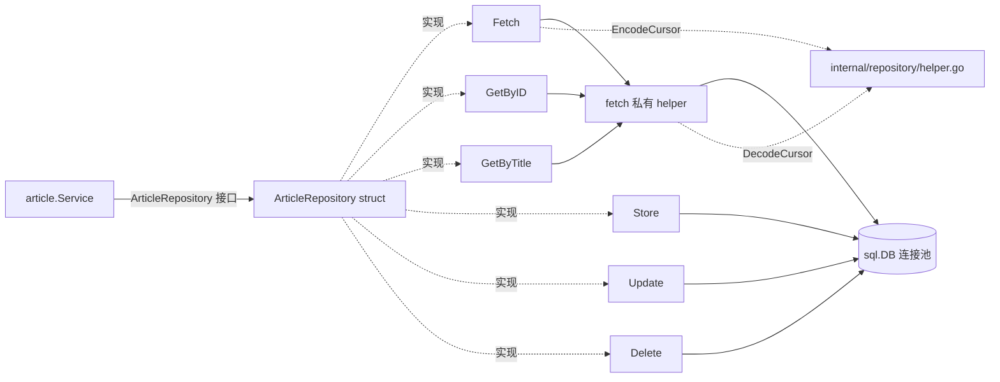

# go-clean-arch · Repository 层拆解（internal/repository/mysql/article.go）

> v4 项目里"对数据库动手"的那一层。本笔记看 150 行的纯原生 `database/sql` 实现怎么在不开 ORM 的前提下做出 CRUD + keyset 游标分页。接续 [03 · Delivery 层](./03-rest-delivery-layer.md)，是 main.go 里 `mysqlRepo.NewArticleRepository(dbConn)` 那行代码的真实落点。

## 核心要点

- **整个文件 ~150 行，纯原生 `database/sql`**：go.mod 只有 `go-sql-driver/mysql`（driver）+ `DATA-DOG/go-sqlmock`（测试 mock），没有 sqlx / gorm / ent / sqlc。
- **`fetch` 私有 helper 是最强 DRY**：`Fetch` / `GetByID` / `GetByTitle` 三种"读"全部退化到一行 `m.fetch(ctx, query, args...)`。
- **用 keyset 游标分页，不用 OFFSET**：`WHERE created_at > ? ORDER BY created_at LIMIT ?`，无论翻到第几页都只扫 `num` 行；游标由 `internal/repository/helper.go` 的 base64+RFC3339 编码。
- **`Update` / `Delete` 检查 `RowsAffected != 1`**：等于 0 是"行不存在"，大于 1 是"primary key 重复"的脏数据信号。
- **`Store` 直接 `a.ID = lastID` 回写**：从 MySQL 拿到自增 ID 后回填到入参结构体，省一次 SELECT。

## 关键示例

### 构造函数：返回具体 struct，接口断言留给调用方

```go
// internal/repository/mysql/article.go
type ArticleRepository struct {
    Conn *sql.DB
}

func NewArticleRepository(conn *sql.DB) *ArticleRepository {
    return &ArticleRepository{conn}
}
```

注意 `author.go` 的字段命名不一致：

```go
// internal/repository/mysql/author.go
type AuthorRepository struct {
    DB *sql.DB   // ← 字段名不一样
}
```

同一个项目里 `DB` vs `Conn`，复制模板时的常见疏忽。**接口不关心这个字段名**，所以不影响正确性。

### fetch：把"扫描 N 行"抽成私有工具

```go
func (m *ArticleRepository) fetch(ctx context.Context, query string, args ...interface{}) (result []domain.Article, err error) {
    rows, err := m.Conn.QueryContext(ctx, query, args...)
    if err != nil { logrus.Error(err); return nil, err }

    defer func() {
        if errRow := rows.Close(); errRow != nil { logrus.Error(errRow) }
    }()

    result = make([]domain.Article, 0)
    for rows.Next() {
        t := domain.Article{}
        authorID := int64(0)
        err = rows.Scan(&t.ID, &t.Title, &t.Content, &authorID, &t.UpdatedAt, &t.CreatedAt)
        if err != nil { logrus.Error(err); return nil, err }
        t.Author = domain.Author{ID: authorID}
        result = append(result, t)
    }
    return result, nil
}
```

下面三个公开方法复用它：

```go
// Fetch
res, err := m.fetch(ctx, query, decodedCursor, num)

// GetByID
list, err := m.fetch(ctx, query, id)

// GetByTitle
list, err := m.fetch(ctx, query, title)
```

### Fetch：keyset 游标分页

```go
func (m *ArticleRepository) Fetch(ctx context.Context, cursor string, num int64) (res []domain.Article, nextCursor string, err error) {
    query := `SELECT id,title,content, author_id, updated_at, created_at
              FROM article WHERE created_at > ? ORDER BY created_at LIMIT ?`

    decodedCursor, err := repository.DecodeCursor(cursor)
    if err != nil && cursor != "" {        // ← 双条件关键
        return nil, "", domain.ErrBadParamInput
    }

    res, err = m.fetch(ctx, query, decodedCursor, num)
    if err != nil { return nil, "", err }

    if len(res) == int(num) {
        nextCursor = repository.EncodeCursor(res[len(res)-1].CreatedAt)
    }
    return
}
```

### 游标编解码（internal/repository/helper.go）

```go
const timeFormat = "2006-01-02T15:04:05.999Z07:00"

func EncodeCursor(t time.Time) string {
    timeString := t.Format(timeFormat)
    return base64.StdEncoding.EncodeToString([]byte(timeString))
}

func DecodeCursor(encodedTime string) (time.Time, error) {
    byt, err := base64.StdEncoding.DecodeString(encodedTime)
    if err != nil { return time.Time{}, err }
    t, err := time.Parse(timeFormat, string(byt))
    return t, err
}
```

### 写操作：Prepare + Exec + 取自增 / 影响行数

```go
func (m *ArticleRepository) Store(ctx context.Context, a *domain.Article) (err error) {
    query := `INSERT article SET title=? , content=? , author_id=?, updated_at=? , created_at=?`
    stmt, err := m.Conn.PrepareContext(ctx, query)
    if err != nil { return }
    res, err := stmt.ExecContext(ctx, a.Title, a.Content, a.Author.ID, a.UpdatedAt, a.CreatedAt)
    if err != nil { return }
    lastID, err := res.LastInsertId()
    if err != nil { return }
    a.ID = lastID
    return
}
```

```go
// Delete 风格（Update 一致）
res, err := stmt.ExecContext(ctx, id)
rowsAfected, err := res.RowsAffected()
if rowsAfected != 1 {
    err = fmt.Errorf("weird  Behavior. Total Affected: %d", rowsAfected)
    return
}
```

## 流程图：仓库方法分布



## 为什么不用 OFFSET 分页？

| 方案 | 数据库要做的事 | 翻到第 1000 页时 |
|---|---|---|
| `LIMIT 20 OFFSET 20000` | 扫 20020 行再丢掉前 20000 | 越来越慢 |
| `WHERE created_at > '2025-01-01' LIMIT 20` | 永远只扫 20 行 | 性能恒定 |

这就是 keyset（seek）分页，适合无限滚动。

## 常见坑

- **缺 `rows.Err()` 检查**：`for rows.Next()` 正常结束不代表全部成功，底层错误要靠 `rows.Err()` 暴露；当前代码漏了，循环外的错误就消失了。
- **`stmt.Close()` 没 defer**：`Store` / `Update` / `Delete` 都拿了 stmt 但没 `defer stmt.Close()`，异常路径下连接池可能留死对象。
- **每次都重新 `PrepareContext`**：prepared statement 的缓存优势完全没拿到，等同于裸 `ExecContext`。生产里应缓存成 struct 字段或用 `sqlx.NamedStmt`。
- **`INSERT article SET ...` 漏写 `INTO`**：MySQL 接受，但 PostgreSQL/SQLite 会拒绝 —— **可移植性隐患**。
- **`weird  Behavior` 两个空格**：原仓库 `Delete` 里的真 typo，知道就好，行为不影响。
- **`author.go.DB` vs `article.go.Conn`**：字段命名不一致。同作者同项目也犯，PR review 时该被点出。
- **`service.Store` 吞了 `GetByTitle` 的 err**：`existedArticle, _ := a.GetByTitle(...)`，导致重复检查可能绕过。

## 配套练习

- ⭐ 把 `fetch` 加 `rows.Err()` 检查 + 用 `defer` 把 stmt.Close 包起来。
- ⭐⭐ 改用 `sqlx`：把 `*sql.DB` 换 `*sqlx.DB`，`fetch` 用 `SelectContext` 一行代替，`Delete` / `Update` 用 `RowsAffected` 简化，整文件从 150 行降到 ~80 行。
- ⭐⭐⭐ 加 `GetByAuthorID(ctx, authorID int64)`：复用 `fetch`，再加 nextCursor 处理，复用 `EncodeCursor`。

## 相关链接

- 上游笔记：[02 · main.go 拆解](./02-main-go-clean-arch.md) · [03 · Delivery 层](./03-rest-delivery-layer.md)
- 平行方案对比：[05 · 原生 database/sql vs sqlx/gorm/sqlc](./05-native-sql-vs-orm.md)
- 仓库：`github.com/bxcodec/go-clean-arch`
- Go database/sql 指南：[go.dev/doc/database/sqldriver](https://go.dev/doc/database/sqldriver)

---
#clean-architecture #repository-layer #mysql #database-sql #cursor-pagination #keyset
