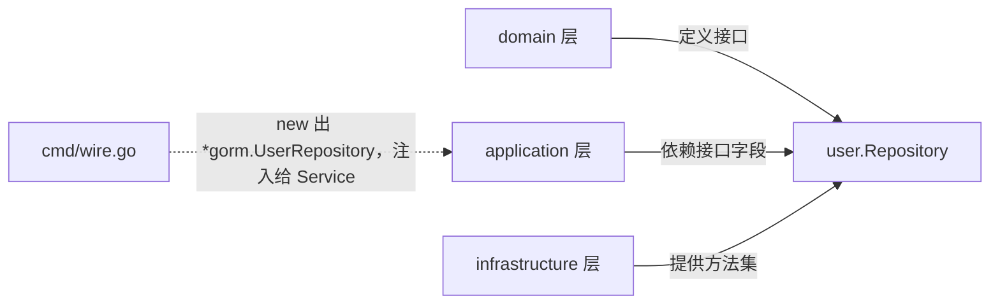

# Register 五层调用链与 Go 依赖反转（含接收者与类型别名）

> 沿着 `AuthHandler.Register` 一路追到 `INSERT INTO users`，把链路、依赖反转、Go 类型小细节一次性搞清楚。

## 核心要点

- `h.svc.Register(ctx, username, password)` 一共穿过 **5 层**：handler → service → 领域工厂 → repository 实现 → MySQL。**没有一层做超出自己职责的事**。
- `user.Repository` 接口定义在 **domain 层**，`*gorm.UserRepository` 实现在 **infrastructure 层**；Go 通过"**方法集匹配**"自动满足接口，Service 只需 `UserRepo = user.Repository` 即可接收任意实现。这是 Clean Architecture 的"**依赖反转**"在 Go 中的具体落地。
- 指针接收者 `(r *UserRepository)` 不是语法必须的，但**强烈推荐**：一致性、避免接口方法集分裂、扩展安全、社区惯例。
- `type userEntity = user.User` 是**类型别名**（用 `=`），不是新类型（用 `:`），二者**完全等价**；这种写法在 infrastructure 包内是命名美化，不改变类型身份。

## 关键示例

### 1. Register 五层链路

```text
[delivery]      AuthHandler.Register            ① 绑定 body、调 service
                       │
[application]   auth.Service.Register            ② 查重 / 调工厂 / Save
                       │
[domain]        user.NewUser (工厂)              ③ 长度校验、bcrypt 哈希
                       │
[domain 接口]   user.Repository                  ④ 契约（5 个方法签名）
                       │
[infrastructure] gorm.UserRepository             ⑤ GORM Create + toEntity
                       │
[DB]            MySQL `users` 表
```

每一层只关心一件事：

| 层 | 关心什么 | 不关心什么 |
|---|---|---|
| Handler | HTTP 协议、入参校验（`binding`）、错误码 → HTTP | 业务规则、SQL |
| Service | 业务编排（查重、错误归一） | SQL、HTTP |
| Domain factory | 业务不变式（长度、密码强度、bcrypt cost=12） | HTTP、ORM |
| Repository interface | 持久化**契约** | ORM、SQL、HTTP |
| GORM impl | ORM 细节（WithContext、Where、Create） | 业务规则、HTTP |

#### Service 一段完整实现（`internal/application/auth/service.go:78`）

```go
func (s *Service) Register(ctx context.Context, username, password string) error {
    // ① 查重
    existing, err := s.users.GetByUsername(ctx, username)
    if err != nil && !errors.Is(err, user.ErrNotFound) {
        return errcode.ErrInternal.WithCause(err)
    }
    if existing != nil {
        return errcode.ErrConflict.WithCause(user.ErrAlreadyExists)
    }
    // ② 工厂创建（密码在这步被哈希）
    u, err := user.NewUser(username, password)
    if err != nil {
        return errcode.ErrInvalidParam.WithCause(err)
    }
    // ③ 持久化
    if _, err := s.users.Save(ctx, u); err != nil {
        return errcode.ErrInternal.WithCause(err)
    }
    return nil
}
```

#### 领域工厂（`internal/domain/user/entity.go:28`）

```go
func NewUser(username, plaintextPassword string) (*User, error) {
    username = strings.TrimSpace(username)
    if username == "" || len(username) > MaxUsernameLen { return nil, ErrInvalidInput }
    if len(plaintextPassword) < MinPasswordLen          { return nil, ErrWeakPassword }
    hash, err := bcrypt.GenerateFromPassword([]byte(plaintextPassword), bcryptCost) // cost=12
    if err != nil { return nil, err }
    now := time.Now()
    return &User{Username: username, PasswordHash: string(hash), CreatedAt: now, UpdatedAt: now}, nil
}
```

注意三层"重复校验用户名长度"：

```text
handler  binding:"required,max=50"     ← 入参边界
domain   NewUser MaxUsernameLen       ← 业务规则
gorm tag  size:50                    ← 数据库列约束
```

这不是冗余，是**洋葱模型**：每一层都做自己关心的边界，越靠内层越接近业务真相。

#### 错误流转映射表

| 触发位置 | errcode | HTTP |
|---|---|---|
| GetByUsername DB 错（非 NotFound） | `ErrInternal` | 500 |
| 用户名已存在 | `ErrConflict` + `ErrAlreadyExists` | 409 |
| 用户名长度非法 | `ErrInvalidParam` + `ErrInvalidInput` | 400 |
| 密码 < 8 | `ErrInvalidParam` + `ErrWeakPassword` | 400 |
| Save 写库错 | `ErrInternal` | 500 |

#### Repository 把基础设施错误翻译成领域错误

```go
err := r.db.WithContext(ctx).Where("username = ?", username).First(&m).Error
if err != nil {
    if errors.Is(err, gorm.ErrRecordNotFound) {
        return nil, user.ErrNotFound                  // ← 翻译：GORM 错误 → 领域错误
    }
    return nil, fmt.Errorf("query user by username: %w", err)
}
return m.toEntity(), nil
```

- `fmt.Errorf("... %w", err)` 的 `%w` 是 Go 1.13+ 错误包装，让 `errors.Is` 能"穿透"到底层
- `*gorm.UserRepository.Save` 返回的是 `m.toEntity()`（**新**实例）而不是 `m` 本身：GORM 把自增 ID 写到 model，原领域对象的 `ID` 仍为 0

### 2. 依赖反转：接口在 domain，实现在 infrastructure

#### 三种"角色"对照

```go
// A 接口（domain 层：internal/domain/user/repository.go）
type Repository interface {
    Save(ctx, *User) (*User, error)
    GetByID(ctx, id int64) (*User, error)
    GetByUsername(ctx, string) (*User, error)
    Update(ctx, *User) error
    Delete(ctx, id int64) error
}

// B 字段类型（application 层：internal/application/auth/service.go）
type UserRepo = user.Repository       // ← 类型别名：和 user.Repository 完全等价
func NewService(users UserRepo, ...)  // ← 形参是接口

// C 实现（infrastructure 层：internal/infrastructure/persistence/gorm/user_repository.go）
func (r *UserRepository) Save(...)            // 满足接口
func (r *UserRepository) GetByID(...)         // 满足接口
func (r *UserRepository) GetByUsername(...)   // 满足接口
func (r *UserRepository) Update(...)          // 满足接口
func (r *UserRepository) Delete(...)          // 满足接口
```

#### 为什么 `*gorm.UserRepository` 能传给 `user.Repository`

Go 不需要 Java/C# 的 `implements` 关键字。规则是**结构子类型（structural subtyping）**：方法集对得上即可。

```text
go typesystem：
   type T struct{}
   func (t T) Foo()     ← T 和 *T 都有 Foo
   func (t *T) Bar()    ← 只有 *T 有 Bar
   如果接口要求 Foo+Bar，只有 *T 满足
```

#### 依赖方向图



```text
application ─▶ domain（接口）
infrastructure ─▶ domain（接口）  ← 反过来"实现"它
composition root ─▶ 把两边缝起来
```

#### 收益

1. **测试可传 mock**
   ```go
   type fakeUserRepo struct{}
   func (f *fakeUserRepo) GetByUsername(...) (*user.User, error) { ... }
   func (f *fakeUserRepo) Save(...)           (*user.User, error) { ... }
   svc := auth.NewService(&fakeUserRepo{}, nil, nil)  // 不连 MySQL
   ```

2. **换实现零成本**：把 `*gorm.UserRepository` 换成 `*memoryUserRepository`（map 实现），Service 一行不用改。

3. **编译期强校验**：Repository 漏实现一个方法，**wire.go 那一行**就会报"doesn't implement user.Repository"，失误拦在编译期。

### 3. Go 小细节 A：指针接收者 `(r *UserRepository)`

#### 什么时候必须用指针

| 场景 | 必用指针 |
|---|---|
| 方法内修改接收者字段（setter） | ✅ |
| 接收者含 `sync.Mutex` 等不可拷贝字段 | ✅ |
| 接收者结构很大，拷贝代价高 | ✅（推荐） |

#### 什么时候**仍然强烈推荐**用指针

| 场景 | 原因 |
|---|---|
| 类型代表"资源/服务" | `UserRepository` 持 `*gorm.DB`，是单例服务对象，惯用法就是指针 |
| 一致性 | 一旦有一个指针方法，其他都得是；避免接口方法集分裂 |
| 未来扩展安全 | 新增 `cache *redis.Client` 等字段，值接收者会隐性拷贝导致状态丢失 |

#### 行为差异（核心规则）

```go
type T struct{}
func (t T)  Foo() {}    // 值接收者
func (t *T) Bar() {}    // 指针接收者
```

| 类型 | 值方法集 | 指针方法集 |
|---|---|---|
| `T` | `Foo` | `Foo`, `Bar` |
| `*T` | `Foo`, `Bar` | `Foo`, `Bar` |

**任何类型上只要有一个指针接收者方法，只有 `*T` 满足要求该方法的接口**——这就是为什么必须保持一致性。

### 4. Go 小细节 B：`type userEntity = user.User` 是别名，不是新类型

#### 关键差异

```go
type A = user.User    // ← 别名（=）：与 user.User 完全等价
type B  user.User     // ← 新类型（:）：与 user.User 完全不同
```

```go
type userEntity = user.User
var x *user.User   = &user.User{ID: 1, Username: "zbb"}
var y *userEntity  = x            // ✅ 合法（别名）
*z = *x                            // ✅ 合法
```

#### 为什么这个仓库要写这个别名

- 函数签名在 `gorm` 包内**保持紧凑**：`*userEntity` 写起来比 `*user.User` 短
- 表达"ORM 适配器视角"：内部用本地别名，跨出包外仍叫 `user.User`
- 单一改点：包路径迁移时只改 `type userEntity = user.User` 一行

#### 在仓库里看到的位置

```go
// internal/infrastructure/persistence/gorm/user_repository.go
type userEntity = user.User

func (m *UserModel) toEntity() *userEntity {
    return &userEntity{
        ID: m.ID, Username: m.Username, PasswordHash: m.PasswordHash,
        CreatedAt: m.CreatedAt, UpdatedAt: m.UpdatedAt,
    }
}
```

跨出该包（其他包使用 Repository 时）只剩 `*user.User`、`user.Repository`，看不到 `userEntity` 这个名字——它只在 ORM 适配器内部存在。

## 常见坑

- **`fmt.Errorf("%v", err)`**：会丢错误链；要用 `%w` 才能 `errors.Is/Unwrap`。
- **`err == gorm.ErrRecordNotFound`**：包装过的错误会判等失败，必须用 `errors.Is`。
- **`First` vs `Take` vs `Find`**：要用业务期望决定。`First` 0 行时返回 `ErrRecordNotFound`；`Take` 静默给零值；`Find` 给空切片。
- **重复注册 → 500 而不是 409**：当前代码查重后写库，有 TOCTOU 竞争，落到 MySQL 唯一索引错误时被翻译成 `ErrInternal`，理想应该是 `ErrConflict`。
- **实体 ID 漂移**：`Save` 返回**新**实体（含 ID），修改原实体无效；如果你指望 `u.ID = 1` 自动生效，会踩坑。
- **Repository 翻译 `gorm.ErrRecordNotFound`**：`user.ErrNotFound` 是 **sentinel errors**，必须 `errors.Is` 判等，不能直接 `==` 比较两个 `errors.New(...)`。
- **类型别名 vs 新类型误判**：报错"cannot use xxx (variable of type X) as Y"时要先去看**定义处**用的是 `=` 还是 `:`，决定是同一类型还是需要显式转换。

## 相关链接

- 入口拆分与 Swagger → [06 · cmd 双入口、wire 组合根、Swagger 与 Bearer 协议实战](./06-cmd-entries-wire-and-bearer.md)
- Repository 接口定义 → [04 · Repository 层拆解（internal/repository/mysql/article.go）](./04-repository-mysql-layer.md)
- Deliver/Service 关系 → [03 · Delivery 层拆解（internal/rest/article.go）](./03-rest-delivery-layer.md)
- Clean Architecture 整套 → [golang/notes/go-clean-arch/](./)

---
#clean-arch #dependency-inversion #pointer-receiver #type-alias #domain-driven-design #golang
