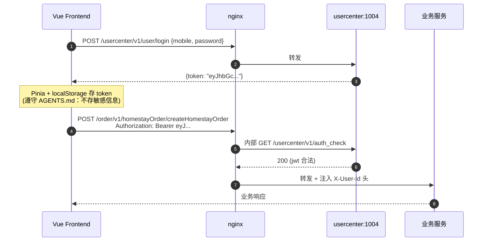

# 后端 REST API 完整清单（自动扫描于 2026-08-12）

> 数据来源：`go-project/go-zero-looklook-new/app/**/{desc/*.api, internal/handler/routes.go}`
> 通过 mermaid + 表格双视图呈现，便于前端 API 客户端生成。

---

## 0. 服务拓扑

```
                          ┌─────────────────────────────────────┐
                          │   nginx (auth_request + 静态托管)   │
                          │   /usercenter  /travel  /order  /pay│
                          └─────────────────────────────────────┘
                                 │            │          │
       ┌─────────────────────────┼────────────┼──────────┼────────────────────┐
       │                         ▼            ▼          ▼                    │
 usercenter:1004             travel:1003   order:1001  payment:1002          mqueue:*
   6 endpoint                  8 endpoint  3 endpoint  2 endpoint          (无 REST)
```

## 1. 完整路由清单（19 个端点）

### 1.1 usercenter (端口 1004, base `/usercenter/v1`)

| 方法 | 路径               | 鉴权   | 用途                      | 备注                        |
| ---- | ------------------ | ------ | ------------------------- | --------------------------- |
| POST | `/user/register`   | ❌     | 用户注册                  |                             |
| POST | `/user/login`      | ❌     | 用户登录                  | 返回 JWT                    |
| GET  | `/auth_check`      | ❌     | nginx auth_request 子请求 | **前端不调用**              |
| POST | `/auth_check`      | ❌     | 同上（外部 curl 用）      | **前端不调用**              |
| POST | `/user/detail`     | ✅ JWT | 当前用户详情              |                             |
| POST | `/user/wxMiniAuth` | ✅ JWT | 微信小程序授权            | 含 jwt 是奇怪的，**待复核** |

### 1.2 travel (端口 1003, base `/travel/v1`)

| 方法 | 路径                                         | 鉴权 | 用途             |
| ---- | -------------------------------------------- | ---- | ---------------- |
| POST | `/homestay/homestayList`                     | ❌   | 民宿列表（分页） |
| POST | `/homestay/businessList`                     | ❌   | 房东名下所有房间 |
| POST | `/homestay/guessList`                        | ❌   | "猜你喜欢"推荐   |
| POST | `/homestay/homestayDetail`                   | ❌   | 民宿详情         |
| POST | `/homestayBussiness/goodBoss`                | ❌   | 推荐"好房东"列表 |
| POST | `/homestayBussiness/homestayBussinessList`   | ❌   | 民宿店铺列表     |
| POST | `/homestayBussiness/homestayBussinessDetail` | ❌   | 房东 / 店铺详情  |
| POST | `/homestayComment/commentList`               | ❌   | 某民宿评论列表   |

### 1.3 order (端口 1001, base `/order/v1`)

| 方法 | 路径                                     | 鉴权   | 用途         |
| ---- | ---------------------------------------- | ------ | ------------ |
| POST | `/homestayOrder/createHomestayOrder`     | ✅ JWT | 创建民宿订单 |
| POST | `/homestayOrder/userHomestayOrderList`   | ✅ JWT | 我的订单     |
| POST | `/homestayOrder/userHomestayOrderDetail` | ✅ JWT | 订单详情     |

### 1.4 payment (端口 1002, base `/payment/v1`)

| 方法 | 路径                                      | 鉴权                     | 用途                      |
| ---- | ----------------------------------------- | ------------------------ | ------------------------- |
| POST | `/thirdPayment/thirdPaymentWxPay`         | ✅ JWT                   | 前端发起微信支付          |
| POST | `/thirdPayment/thirdPaymentWxPayCallback` | ❌（微信服务器直接调用） | 微信回调 — **前端不调用** |

### 1.5 mqueue

无 REST，所有任务异步消费，前端无需对接。

---

## 2. 字段类型速查

| Go 类型   | TS 类型   | 备注                                                   |
| --------- | --------- | ------------------------------------------------------ |
| `int64`   | `number`  | unix 时间戳 **也用 int64**，前端需 new Date(ts * 1000) |
| `float64` | `number`  | **单位是"分"**（金额都 *100）                          |
| `string`  | `string`  |                                                        |
| `bool`    | `boolean` |                                                        |

订单价格示例：后端给 `HomestayPrice: 31004` → 前端展示 `380.00 元`。

---

## 3. 鉴权流程



> **关键**：前端不需要自己解析 token、也不需要调 auth_check —— 都交给 nginx + 后端。
> 前端只关心：
>
> 1. 登录后拿 token
> 2. 每个请求加 `Authorization: Bearer <token>`
> 3. 401 → 清 token 跳登录页

---

## 4. MVP 页面 ↔ API 对应（修订版）

| 前端页面                          | 用到的 API                                           |
| --------------------------------- | ---------------------------------------------------- |
| `/` 首页 Feed                     | `guessList` + `goodBoss` + `homestayBussinessList`   |
| `/homestay` 民宿搜索列表          | `homestayList`                                       |
| `/homestay/:id` 民宿详情          | `homestayDetail` + `commentList`                     |
| `/homestay/:id/booking` 下单      | （前端表单 +）`createHomestayOrder`                  |
| `/homestay/businesses` 房东列表   | `homestayBussinessList`                              |
| `/homestay/business/:id` 房东详情 | `homestayBussinessDetail` + `businessList`（其房源） |
| `/order` 订单列表                 | `userHomestayOrderList`                              |
| `/order/:sn` 订单详情             | `userHomestayOrderDetail`                            |
| `/pay/:sn` 收银台                 | `thirdPaymentWxPay` + 调起微信支付 SDK               |
| `/login`                          | `user/login`                                         |
| `/register`                       | `user/register`                                      |
| `/u/me` 个人中心                  | `user/detail`                                        |

共 **12 页**，5 个 API 模块，**严格 1:1 对应**后端能力。

---

## 5. 缺失 API（待用户/产品确认）

扫完后发现后端**没有以下能力**，意味着前端即使想做也没接口：

- ❌ **用户编辑资料**：没有 `user/update` 接口
- ❌ **评论发布**：没有 `comment/create` 接口 → MVP 不做评论发布，只读
- ❌ **收藏 / 喜欢**：列表返回的 `isFav` 字段，但后端没看到 `fav/toggle` 接口
- ❌ **订单取消 / 退款**：没有看到对应接口，仅有 tradeState 状态
- ❌ **支付回调页**：后端负责，前端只需 `pay/result` 显示成功 / 失败

这些**必须由用户在阶段 3 之前确认**是延后还是删需求。
