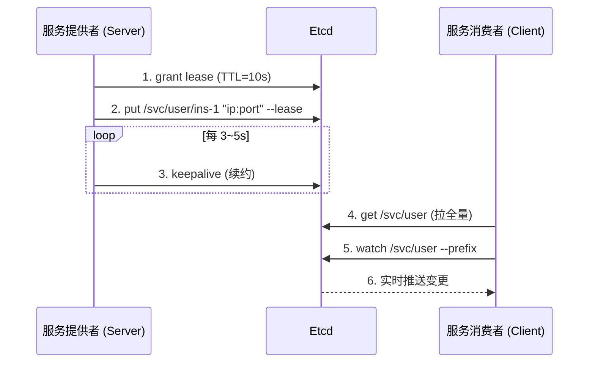

# Etcd 服务发现：原理与 go-zero 实战

> 分布式 KV 存储 Etcd 通过 **Lease + Watch + TTL** 三大机制实现生产级服务发现；go-zero 内置封装让你"零代码"完成注册与发现。

## TL;DR

- **Etcd = Raft + KV + Watch + Lease**：CNCF 毕业项目，强一致性的分布式 KV 存储
- **三大机制**：
  - **Lease（租约）**：key 绑定 TTL，过期自动删除；进程周期性 KeepAlive 续约
  - **Watch（监听）**：key 变更时 Etcd **主动推送** 事件给订阅者
  - **TTL**：故障实例在 TTL 到期后**自动剔除**
- **go-zero 的封装**：在 yaml 里写 `Etcd:` 块，**0 行 Etcd 客户端代码**，自动完成「注册 + 发现 + 负载均衡」
- **go-zero 默认行为**：底层 key 形如 `order.rpc/<leaseID>`（不带前导 `/`），同一服务的所有实例共享同一个 Key

---

## 一、Etcd 是什么

| 维度 | 说明 |
|------|------|
| 类型 | 分布式、强一致性的 KV 存储系统 |
| 一致性算法 | Raft |
| 出身 | CoreOS 发起，现为 **CNCF 毕业项目** |
| 通信 | gRPC（v3 API）/ HTTP（v2 API）|
| 典型用途 | 服务发现、配置共享、分布式锁、选主（K8s 用它存集群状态）|

---

## 二、服务发现的三大核心机制

### 1. Lease（租约）

```bash
# 申请 10s 的租约
etcdctl lease grant 10
# lease 32695410dcc0ca06 granted with TTL(10s)

# put key 时绑定 lease
etcdctl put /services/user/ins-1 "127.0.0.1:8080" --lease=32695410dcc0ca06
```

- TTL 到期 → key 自动删除
- 服务进程必须**周期性 KeepAlive** 续约，否则自动"下线"

### 2. Watch（监听）

```bash
# 监听某前缀的所有 key 变化
etcdctl watch /services/user --prefix
```

- key 变化（Put/Delete）时，Etcd 主动推送事件
- 这是「实时感知」实例上下线的关键

### 3. KV + TTL 自动剔除

约定目录结构：

```
/services/
├── user/instance-1 -> "<node-ip>:8080"
├── user/instance-2 -> "<node-ip>:8080"
└── order/instance-1 -> "<node-ip>:9000"
```

---

## 三、服务发现完整流程



| 异常场景 | 检测方式 | 结果 |
|---------|---------|------|
| 进程崩溃 | KeepAlive 中断 | TTL 过期 → key 删除 |
| 网络分区 | 心跳超时 | TTL 过期 → key 删除 |
| GC 暂停 | KeepAlive 失败 | lease 撤销 |
| **优雅下线** | 主动 `Revoke` | key 立即删除 |

---

## 四、go-zero 内置集成：零代码完成

> go-zero 的 `zrpc` 把 Etcd 的 Lease/Watch/TTL 全部封装好，你只需要写 yaml。

### 4.1 服务端：注册（写一个 `Etcd:` 块）

```yaml
# order-rpc/etc/order.yaml
Name: order.rpc-1
ListenOn: 0.0.0.0:8081
Etcd:
  Hosts:
    - 127.0.0.1:2379
  Key: order.rpc          # ← 所有实例共享此 Key
```

启动 `zrpc.MustNewServer(c.RpcServerConf, ...)` 时，go-zero 自动：
1. 调用 `discov.NewPublisher(etcd.Hosts, "order.rpc", "ip:port")`
2. Grant(TTL) + Put(key=`order.rpc/<leaseID>`, value=ip:port) + KeepAlive
3. 注册 `proc.AddShutdownListener`，进程退出时 Revoke

### 4.2 客户端：发现（一行代码）

```yaml
# order-api/etc/order-api.yaml
Name: order-api
Host: 0.0.0.0
Port: 8888
OrderRpc:
  Etcd:
    Hosts:
      - 127.0.0.1:2379
    Key: order.rpc        # ← 与服务端一致
  Timeout: 3000
```

```go
// order-api/internal/svc/servicecontext.go
client := zrpc.MustNewClient(c.OrderRpc)   // ← 一行搞定
return &ServiceContext{OrderRpc: order.NewOrder(client), ...}
```

`zrpc.MustNewClient` 内部：
1. 注册 gRPC resolver scheme：`etcd:///host?key=order.rpc`
2. 启动时 Get(prefix) 拉全量实例
3. Watch(prefix) 监听变更
4. P2C 负载均衡 + 错误率剔除

### 4.3 关键源码（了解即可）

| 阶段 | 关键文件 | 说明 |
|------|---------|------|
| 服务注册 | `zrpc/internal/rpcpubserver.go` | 检测到 Etcd → 创建 keepAliveServer |
| 注册细节 | `core/discov/publisher.go` | Grant / Put / KeepAlive / Revoke |
| 服务发现 | `zrpc/resolver/internal/etcdbuilder.go` | gRPC resolver scheme `etcd://` |
| 实例变更 | `core/discov/subscriber.go` | 监听 Watch，更新本地实例池 |
| 负载均衡 | `zrpc/internal/client.go` → `p2c/p2c.go` | P2C（Pick Of Two Choices）|

---

## 五、两种实现方式对比

| 维度 | 原始 etcd 客户端 | **go-zero 内置** |
|------|----------------|------------------|
| 注册代码 | 手写 Grant/Put/KeepAlive 约 10 行 | **0 行**（yaml 配置）|
| 发现代码 | 手写 Get/Watch/事件循环 约 30 行 | **0 行**（yaml 配置）|
| 负载均衡 | 自己实现 | **内置 P2C** |
| 健康检查 | 手动 | **内置** |
| 优雅下线 | 手动 Revoke | **内置**（监听 SIGTERM）|
| 适用场景 | 教学（看清底层）| **生产首选** |

---

## 六、go-zero 的实际注册路径

注意 go-zero 生成的 key **不带前导 `/`**：

```
order.rpc/7668679782159995142
<pod-ip>:8081
order.rpc/7668679782159995145
<pod-ip>:8082
```

- Key = `<Etcd.Key>/<leaseID>` （`makeEtcdKey` 函数拼接）
- Value = `<ip>:<port>` （`figureOutListenOn` 会自动用 POD_IP 或内网 IP）
- 查询时用 `etcdctl get order.rpc/ --prefix`

---

## 七、本地调试常见命令

```bash
# 启动单节点 etcd
etcd --data-dir=/tmp/etcd-data \
     --listen-client-urls=http://127.0.0.1:2379 \
     --advertise-client-urls=http://127.0.0.1:2379

# 查看所有实例
etcdctl --endpoints=127.0.0.1:2379 get order.rpc/ --prefix

# 实时观察上下线
etcdctl --endpoints=127.0.0.1:2379 watch order.rpc/ --prefix

# 查看某个实例的 lease 状态
etcdctl --endpoints=127.0.0.1:2379 lease list
```

---

## 八、最佳实践

1. **Key 设计**：用层级路径 + 共享 Key（实例通过 leaseID 后缀区分）
   ```
   <Etcd.Key>/<auto-lease-id> → "<ip>:<port>"
   ```

2. **TTL 选择**：建议 **5~15s**
   - 过短 → 心跳压力，GC 抖动易误删
   - 过长 → 故障检测慢

3. **优雅下线**：进程收到 SIGTERM 时主动 Revoke，让 consumer 立即收到 delete 事件

4. **多实例可观测**：业务响应里带回 `instanceID`，便于排查"请求到底打到哪个实例"

5. **Etcd 鉴权**：生产环境务必开启 **TLS + RBAC**

6. **客户端缓存**：Consumer 必须缓存实例列表，Etcd 故障时全链路不至于雪崩

7. **环境变量**：用 `POD_IP` 或 `INSTANCE_ID` 标识实例身份，配合 logx 自动打印

---

## 九、与其他方案对比

| 特性 | Etcd | Consul | Zookeeper | Nacos |
|------|------|--------|-----------|-------|
| 一致性协议 | Raft | Raft | ZAB | Raft/自身 |
| Watch 能力 | ✅ 强 | ✅ | ✅ | ✅ |
| KV TTL | ✅ Lease | ✅ Session | ⚠️ 临时节点 | ✅ |
| go-zero 支持 | ✅ 内置 | ✅ 内置 | ✅ 内置 | ✅ 内置 |

---

## 十、参考

- [go-zero 源码：zrpc/internal/rpcpubserver.go](https://github.com/zeromicro/go-zero/blob/master/zrpc/internal/rpcpubserver.go)
- [go-zero 源码：core/discov/publisher.go](https://github.com/zeromicro/go-zero/blob/master/core/discov/publisher.go)
- [Etcd 官方文档](https://etcd.io/docs/)
- 本地 demo：项目内 `etcd-demo/`（原始客户端）/ `etcd-gozero-demo/`（go-zero 内置）

---
#etcd #服务发现 #go-zero #分布式 #微服务 #Kubernetes
